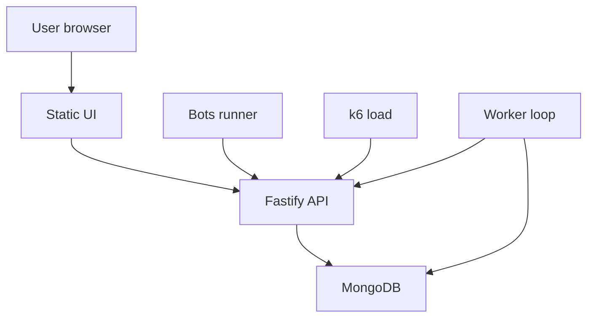

# AUDIT GUIDE — contest-auction

Цель документа: дать внешнему ревьюеру (аудитор/агент/QA) **чеклист + карту кода**, чтобы быстро находить пробелы и риски в реализации аукциона.

Проектный контекст (входная точка): [`contest-auction/README.md`](contest-auction/README.md:1)

Связанная спецификация механики: [`docs/spec.md`](docs/spec.md:1)

> Важно: реализация является production-ready решением. Ревьюеру нужно проверить **соответствие спецификации** и **корректность критических механик** (конкурентность, финансы, идемпотентность).

---

## Оглавление

- [1. Overview](#1-overview)
- [2. Репозиторий и компоненты](#2-репозиторий-и-компоненты)
- [3. Архитектура и основные потоки](#3-архитектура-и-основные-потоки)
- [4. Data model и схема данных](#4-data-model-и-схема-данных)
- [5. Механика аукциона: правила и их реализация](#5-механика-аукциона-правила-и-их-реализация)
- [6. API Reference](#6-api-reference)
- [7. Конкурентность, атомарность, идемпотентность](#7-конкурентность-атомарность-идемпотентность)
- [8. Финансы и ledger: инварианты и сценарии](#8-финансы-и-ledger-инварианты-и-сценарии)
- [9. Anti-sniping: правила и тестирование](#9-anti-sniping-правила-и-тестирование)
- [10. Worker: расписание, recovery, безопасные ретраи](#10-worker-расписание-recovery-безопасные-ретраи)
- [11. Нагрузка: k6 (как запускать, что считать успехом)](#11-нагрузка-k6-как-запускать-что-считать-успехом)
- [12. UI: как пользоваться и быстро прогнать демо](#12-ui-как-пользоваться-и-быстро-прогнать-демо)
- [13. Deploy: python-скрипт и проверка на сервере](#13-deploy-python-скрипт-и-проверка-на-сервере)
- [14. Checklist для внешнего ревьюера + риски/улучшения](#14-checklist-для-внешнего-ревьюера--рискиулучшения)
- [15. Модель лотов и финализация](#15-модель-лотов-и-финализация)

---

## 1. Overview

### Что это

`contest-auction` — production-ready сервис: Node.js + TypeScript с HTTP API, веб-интерфейсом, воркером автозакрытия раундов, и инструментами для нагрузочного тестирования.

Сервер стартует Fastify и раздаёт статический UI + API:
- сервер: [`main()`](contest-auction/src/index.ts:35)
- health-check: [`app.get('/health')`](contest-auction/src/index.ts:13)
- API plugin: [`apiPlugin()`](contest-auction/src/api/index.ts:6)
- UI (статик): [`public/`](contest-auction/public/index.html:1)

### Цели конкурса (в контексте аудита)

Ревьюер должен подтвердить (или опровергнуть) следующие свойства:

1) Корректность механики аукциона относительно спецификации [`docs/spec.md`](docs/spec.md:1)

2) Корректность финансовых операций (hold/release/capture) и идемпотентность

3) Безопасность конкурентной обработки ставок и закрытий раундов

4) Наблюдаемость/диагностируемость инцидентов (ошибки API, конфликты, поведение воркера)

5) Реплицируемость (локальный запуск, нагрузка k6, деплой)

---

## 2. Репозиторий и компоненты

### Карта подпроекта

- API + сервер: [`contest-auction/src/index.ts`](contest-auction/src/index.ts:1)
- API роуты: [`contest-auction/src/api/routes/auctions.ts`](contest-auction/src/api/routes/auctions.ts:1), [`contest-auction/src/api/routes/accounts.ts`](contest-auction/src/api/routes/accounts.ts:1)
- Domain/services:
  - аукционы: [`AuctionService`](contest-auction/src/modules/auctions/service.ts:52)
  - ledger/балансы: [`LedgerService`](contest-auction/src/modules/ledger/service.ts:32)
- Worker (автозакрытие): [`contest-auction/src/worker.ts`](contest-auction/src/worker.ts:1)
- Модели Mongo (mongoose):
  - [`AuctionModel`](contest-auction/src/models/Auction.ts:71)
  - [`BidModel`](contest-auction/src/models/Bid.ts:48)
  - [`AccountModel`](contest-auction/src/models/Account.ts:43)
  - [`LedgerEntryModel`](contest-auction/src/models/LedgerEntry.ts:56)
  - (заготовка для будущих расширений) [`OutboxEventModel`](contest-auction/src/models/OutboxEvent.ts:36)
- UI: [`contest-auction/public/app.js`](contest-auction/public/app.js:1)
- Bots (автоматизированная нагрузка): [`contest-auction/src/bots/runBots.ts`](contest-auction/src/bots/runBots.ts:1)
- Load test (k6): [`contest-auction/load/k6.js`](contest-auction/load/k6.js:1)
- Deploy (ssh/systemd/docker compose): [`contest-auction/deploy/deploy.py`](contest-auction/deploy/deploy.py:1)
- Инфраструктура Mongo локально: [`contest-auction/docker-compose.yml`](contest-auction/docker-compose.yml:1)

### Компонентная схема (упрощённо)



Привязка к коду:

- UI обслуживается через [`fastifyStatic`](contest-auction/src/index.ts:38)
- API роуты подключаются через [`apiPlugin()`](contest-auction/src/api/index.ts:6)
- Worker читает `Auction` из Mongo и вызывает [`AuctionService.closeCurrentRound()`](contest-auction/src/modules/auctions/service.ts:381)

---

## 3. Архитектура и основные потоки

### 3.1. Сервер и маршрутизация

- Сервер создаётся в [`Fastify()`](contest-auction/src/index.ts:9)
- Валидация: кастомный errorHandler для ошибок schema validation в [`app.setErrorHandler()`](contest-auction/src/index.ts:17)
- API префикс `/api` задаётся при регистрации роутов в [`apiPlugin()`](contest-auction/src/api/index.ts:6)

### 3.2. Основные потоки (end-to-end)

#### Поток A: депозит → ставка

1) Пополнение счёта
   - endpoint: [`POST /api/accounts/:subjectId/deposit`](contest-auction/src/api/routes/accounts.ts:29)
   - сервис: [`LedgerService.deposit()`](contest-auction/src/modules/ledger/service.ts:39)

2) Ставка
   - endpoint: [`POST /api/auctions/:id/bids`](contest-auction/src/api/routes/auctions.ts:86)
   - сервис: [`AuctionService.placeBid()`](contest-auction/src/modules/auctions/service.ts:213)
   - внутри ставки делаются:
     - проверка статуса/eligible/времени закрытия
     - проверка min increment
     - финансовый hold на дельту: [`LedgerService.placeHold()`](contest-auction/src/modules/ledger/service.ts:51)
     - anti-sniping обновление endsAt
     - запись bid (с idempotency key)

#### Поток B: закрытие раунда

Варианты триггера:

- ручной endpoint: [`POST /api/auctions/:id/rounds/close`](contest-auction/src/api/routes/auctions.ts:124)
- worker, который автоматически закрывает просроченные раунды: [`processOnce()`](contest-auction/src/worker.ts:13)

Закрытие происходит в [`AuctionService.closeCurrentRound()`](contest-auction/src/modules/auctions/service.ts:381):

1) Получение топ-K лидеров и квалифицированных участников
2) Для каждого участника, у которого есть ставка:
   - если он qualified → `capture` hold (balance-=amount, hold-=amount): [`LedgerService.captureHold()`](contest-auction/src/modules/ledger/service.ts:80)
   - иначе → `release` hold (hold-=amount): [`LedgerService.releaseHold()`](contest-auction/src/modules/ledger/service.ts:68)
3) Транзакционный условный апдейт аукциона (защита от гонок)
4) Либо переход на следующий раунд, либо завершение

> Важно для аудита: в текущей реализации списание происходит **на закрытии каждого раунда** (capture qualified), а не только на финализации аукциона. Это может расходиться с допущением в [`docs/spec.md`](docs/spec.md:130).

---

## 4. Data model и схема данных

### 4.1. Auction + embedded rounds

Модель: [`AuctionSchema`](contest-auction/src/models/Auction.ts:26)

Ключевые поля:

- `status`: `draft|active|finished|cancelled` (реализация) — [`AuctionStatus`](contest-auction/src/models/Auction.ts:3)
- параметры механики:
  - `roundDurationSec` — [`roundDurationSec`](contest-auction/src/models/Auction.ts:40)
  - `minIncrement` — [`minIncrement`](contest-auction/src/models/Auction.ts:41)
  - `topK` — [`topK`](contest-auction/src/models/Auction.ts:42)
  - `snipingWindowSec`, `extendBySec`, `maxExtensionsPerRound` — [`snipingWindowSec`](contest-auction/src/models/Auction.ts:43)
- текущее состояние раунда (денормализация на корне для быстрых запросов):
  - `currentRoundNo` — [`currentRoundNo`](contest-auction/src/models/Auction.ts:53)
  - `currentRoundEndsAt` — [`currentRoundEndsAt`](contest-auction/src/models/Auction.ts:54)
- embedded history раундов: `rounds: RoundSchema[]` — [`rounds`](contest-auction/src/models/Auction.ts:56)
- eligibility (отсев): `currentRoundEligible?: string[]` — [`currentRoundEligible`](contest-auction/src/models/Auction.ts:47)

Round (embedded) хранит:

- `scheduledEndsAt` (без anti-sniping) — [`scheduledEndsAt`](contest-auction/src/models/Auction.ts:20)
- `endsAt` (effective_end_at с учётом anti-sniping) — [`endsAt`](contest-auction/src/models/Auction.ts:18)
- `extensionsCount` — [`extensionsCount`](contest-auction/src/models/Auction.ts:21)

Индексы:

- поиск просроченных активных аукционов (worker): [`AuctionSchema.index({ status: 1, currentRoundEndsAt: 1 })`](contest-auction/src/models/Auction.ts:65)
- уникальность `code`: [`AuctionSchema.index({ code: 1 }, { unique: true })`](contest-auction/src/models/Auction.ts:67)

### 4.2. Bid

Модель: [`BidSchema`](contest-auction/src/models/Bid.ts:5)

Ключевые поля:

- `auctionId`, `roundNo`, `participantId`
- `amount` (Decimal128)
- `status` (в основном используется `placed`) — [`BidStatus`](contest-auction/src/models/Bid.ts:3)
- `idempotencyKey` (sparse unique per participant+round) — индекс [`BidSchema.index({ auctionId, roundNo, participantId, idempotencyKey }, unique)`](contest-auction/src/models/Bid.ts:41)

Индексы важные для аудита ранжирования:

- топ по ставкам: [`BidSchema.index({ auctionId: 1, roundNo: 1, amount: -1, createdAt: 1 })`](contest-auction/src/models/Bid.ts:35)

### 4.3. Account

Модель: [`AccountSchema`](contest-auction/src/models/Account.ts:5)

Упрощение реализации:

- один `balance` и один `hold` — [`balance`](contest-auction/src/models/Account.ts:11), [`hold`](contest-auction/src/models/Account.ts:18)
- optimistic concurrency включён: [`optimisticConcurrency: true`](contest-auction/src/models/Account.ts:35)

Индекс:

- уникальность `(subjectId, currency)` — [`AccountSchema.index({ subjectId: 1, currency: 1 }, { unique: true })`](contest-auction/src/models/Account.ts:39)

### 4.4. LedgerEntry

Модель: [`LedgerEntrySchema`](contest-auction/src/models/LedgerEntry.ts:12)

Ключевое для аудита:

- `txId` уникален и является источником идемпотентности — [`LedgerEntrySchema.index({ txId: 1 }, { unique: true })`](contest-auction/src/models/LedgerEntry.ts:48)
- `kind`: `deposit|hold|release|capture|...` — [`LedgerKind`](contest-auction/src/models/LedgerEntry.ts:3)

Важно: текущая реализация ledger не является классической double-entry (debitAccountId и creditAccountId одинаковы) — запись создаётся в [`LedgerService.runAtomic()`](contest-auction/src/modules/ledger/service.ts:110).

### 4.5. OutboxEvent (заготовка)

Модель: [`OutboxEventSchema`](contest-auction/src/models/OutboxEvent.ts:5)

Наличие модели без использования — это типичный сигнал для аудитора:

- либо планировался event-driven слой
- либо недоделан recovery / внешние интеграции

---

## 5. Механика аукциона: правила и их реализация

Этот раздел должен читаться как: **правило из спецификации → где и как реализовано → как тестить → какие риски**.

### 5.1. Состояния аукциона

Спецификация предлагает состояния `Created/Active/Finalizing/Finished/Cancelled` — [`Жизненный цикл аукциона`](docs/spec.md:15).

Реализация:

- `draft` (аналог Created)
- `active`
- `finished`
- `cancelled` (в коде модели, но не покрыто API операциями)

Где:

- тип: [`AuctionStatus`](contest-auction/src/models/Auction.ts:3)
- создание: статус выставляется в [`AuctionService.createAuction()`](contest-auction/src/modules/auctions/service.ts:74)
- старт: статус становится `active` в [`AuctionService.startAuction()`](contest-auction/src/modules/auctions/service.ts:108)
- завершение: статус становится `finished` в ветке `shouldFinish` внутри [`AuctionService.closeCurrentRound()`](contest-auction/src/modules/auctions/service.ts:439)

Аудит-вопросы:

- Где реализована отмена и снятие холдов для `cancelled`? (в API отсутствует)
- Нужно ли состояние `finalizing` (особенно если появятся интеграции/внешние платежи)?

### 5.2. Раунды: длительность и конец

Спецификация: у раунда есть `scheduled_end_at` и `effective_end_at` — [`3.1 Длительность`](docs/spec.md:37).

Реализация:

- `scheduledEndsAt` хранится в embedded round — [`scheduledEndsAt`](contest-auction/src/models/Auction.ts:20)
- `endsAt` хранит фактический конец (effective_end_at) — [`endsAt`](contest-auction/src/models/Auction.ts:18)
- дублирование на корне: `currentRoundEndsAt` — [`currentRoundEndsAt`](contest-auction/src/models/Auction.ts:54)

Старт первого раунда:

- вычисление `endsAt = now + roundDurationSec` в [`AuctionService.startAuction()`](contest-auction/src/modules/auctions/service.ts:124)

Тестирование:

- создать аукцион с коротким раундом через [`POST /api/auctions`](contest-auction/src/api/routes/auctions.ts:11)
- стартовать через [`POST /api/auctions/:id/start`](contest-auction/src/api/routes/auctions.ts:53)
- убедиться, что `roundEndsAt` уходит вперёд на `roundDurationSec`

### 5.3. Отсев по top-K (eligibility)

Спецификация: топ-K проходят дальше; остальные теряют право ставить дальше — [`3.3 Кто проходит дальше`](docs/spec.md:55).

Реализация:

- список `qualified` рассчитывается в [`AuctionService.closeCurrentRound()`](contest-auction/src/modules/auctions/service.ts:404)
- на следующий раунд сохраняется `currentRoundEligible = qualified` — [`$set: { currentRoundEligible: qualified }`](contest-auction/src/modules/auctions/service.ts:489)
- при ставке проверяется eligibility в [`AuctionService.placeBid()`](contest-auction/src/modules/auctions/service.ts:248)

Критические вопросы аудита:

- Условие завершения сейчас: `qualified.length === allParticipants.length` — [`shouldFinish`](contest-auction/src/modules/auctions/service.ts:439)
  - это означает: завершение происходит, когда **все ставившие** попали в top-K (например, участников ≤ K)
  - нет понятия количества лотов/победителей, нет финализации по лотам

### 5.4. Ранжирование ставок и tie-break

Спецификация: сортировка по `active_bid_amount desc`, tie-break по `bid_committed_at asc` — [`4.3 Ранжирование`](docs/spec.md:78).

Реализация:

- логика лидерборда построена агрегатом в [`AuctionService.getLeaderboard()`](contest-auction/src/modules/auctions/service.ts:189)
  - сначала сортировка ставок в раунде: `amount desc, createdAt asc`
  - затем group by participantId и выбор первой (тем самым выбирается max amount, и при равенстве — самая ранняя)
  - затем повторная сортировка по amount desc, committedAt asc

Аудит-вопросы:

- что считается committedAt? в модели используется `createdAt` документа Bid
- возможна ли ситуация, когда участник делает несколько ставок, и createdAt победной ставки не отражает «момент фиксации равного значения»?

### 5.5. Min increment

Спецификация: `new_amount ≥ current_amount + min_increment` — [`4.1 Минимальный шаг`](docs/spec.md:65).

Реализация:

- текущая ставка участника считается как максимальная ставка по участнику в раунде: поиск `findOne(...).sort({ amount: -1, createdAt: 1 })` — [`current`](contest-auction/src/modules/auctions/service.ts:264)
- проверка min increment — [`min increment rule violated`](contest-auction/src/modules/auctions/service.ts:273)

Тестирование:

- сделать ставку `100`, затем попытаться `105` при `minIncrement=10` → ожидать `422` и `details.currentAmount/minIncrement`.

### 5.6. Модель «одна активная ставка на участника в раунде»

Спецификация: 1 активная ставка на участника, повышение заменяет предыдущую — [`4.2 Текущая ставка участника`](docs/spec.md:73).

Реализация:

- в БД хранятся все ставки как события, а «активная ставка» вычисляется как max amount в раунде для participantId — [`getLeaderboard()`](contest-auction/src/modules/auctions/service.ts:189)

Аудит-вопросы:

- что делать с историей ставок (void/rejected) — статусы в модели есть, но в коде используются минимально — [`BidStatus`](contest-auction/src/models/Bid.ts:3)

### 5.7. Деньги на ставке: hold только на дельту

Спецификация: при повышении ставки холд увеличивается на дельту — [`6.1 Когда холдим`](docs/spec.md:119).

Реализация:

- delta = newAmount - currentAmount — [`delta`](contest-auction/src/modules/auctions/service.ts:283)
- hold выполняется на delta — [`LedgerService.placeHold()`](contest-auction/src/modules/auctions/service.ts:299)
- txId для hold: [`holdTxId`](contest-auction/src/modules/auctions/service.ts:295)

Риски:

- вычисления идут через `Number(...)` (потенциальная потеря точности/переполнение для больших сумм) — например [`Number(newAmount)`](contest-auction/src/modules/auctions/service.ts:273)

### 5.8. Закрытие раунда и финансовые последствия

Спецификация (допущение): списания в финализации; проигравшим release — [`6.2 Когда списываем`](docs/spec.md:130), [`6.3 Когда возвращаем`](docs/spec.md:138).

Реализация сейчас:

- при закрытии раунда qualified получают `capture` (снижается balance и hold) — [`captureHold()`](contest-auction/src/modules/auctions/service.ts:425)
- неqualified получают `release` (снижается hold) — [`releaseHold()`](contest-auction/src/modules/auctions/service.ts:428)

Это означает:

- квалификация = немедленное списание, а не резерв
- если будет несколько раундов и участник прошёл несколько раз, он может платить несколько раз, если не предусмотрен механизм «переноса платежа» (в текущей реализации такого механизма нет по дизайну)

Аудитор должен зафиксировать: это осознанное архитектурное решение или требует доработки относительно продуктовой механики.

---

## 6. API Reference

База API: `http://<host>:3000/api` — см. [`contest-auction/README.md`](contest-auction/README.md:130)

Формат ошибок: [`ApiErrorBody`](contest-auction/src/shared/http.ts:3)

### 6.1. Health

#### `GET /health`

Где: [`app.get('/health')`](contest-auction/src/index.ts:13)

Ответ `200`:

```json
{ "status": "ok" }
```

### 6.2. Accounts

#### `GET /api/accounts/:subjectId?currency=RUB`

Где: [`GET /accounts/:subjectId`](contest-auction/src/api/routes/accounts.ts:11)

Параметры:

- `subjectId` (path) — строка
- `currency` (query) — строка, default `RUB`

Успех `200` (пример):

```json
{
  "subjectId": "u1",
  "currency": "RUB",
  "total": "1000",
  "held": "100",
  "available": "900"
}
```

Ошибки:

- `404 NotFound` если аккаунт отсутствует — [`account not found`](contest-auction/src/api/routes/accounts.ts:24)

#### `POST /api/accounts/:subjectId/deposit`

Где: [`POST /accounts/:subjectId/deposit`](contest-auction/src/api/routes/accounts.ts:29)

Body:

- `amount` (string|number) — см. [`Amount`](contest-auction/src/api/schemas.ts:3)
- `currency` (optional)
- `txId` (optional) — идемпотентность

Идемпотентность:

- заголовок `idempotency-key` или `x-idempotency-key` используется как `txId`, если не задан в body — [`headerTxId`](contest-auction/src/api/routes/accounts.ts:42)

Успех `200`:

```json
{
  "account": {
    "subjectId": "u1",
    "currency": "RUB",
    "total": "1000",
    "held": "0",
    "available": "1000"
  }
}
```

Ошибки:

- `400 BadRequest` — например, если amount <= 0 — [`amount must be > 0`](contest-auction/src/modules/ledger/service.ts:124)

### 6.3. Auctions

#### `POST /api/auctions`

Где: [`POST /auctions`](contest-auction/src/api/routes/auctions.ts:11)

Body (основные):

- `code` string (unique)
- `title` string
- `currency` optional
- `roundDurationSec` optional (>=5)
- `minIncrement` (Amount)
- `topK` optional
- `snipingWindowSec` optional
- `extendBySec` optional
- `maxExtensionsPerRound` optional

Успех `201` (пример):

```json
{
  "id": "<objectId>",
  "code": "A-001",
  "title": "Gift auction demo",
  "status": "draft",
  "currency": "RUB"
}
```

Ошибки:

- `409 Conflict` при duplicate key (code) — ветка обработки в [`auctionsRoutes`](contest-auction/src/api/routes/auctions.ts:45)

#### `POST /api/auctions/:id/start`

Где: [`POST /auctions/:id/start`](contest-auction/src/api/routes/auctions.ts:53)

Успех `200` (пример):

```json
{
  "id": "<objectId>",
  "code": "A-001",
  "title": "Gift auction demo",
  "status": "active",
  "currency": "RUB",
  "currentRoundNo": 1,
  "roundEndsAt": "2026-01-01T00:00:30.000Z"
}
```

Ошибки:

- `404 NotFound` если id невалиден/не найден — [`auction not found`](contest-auction/src/api/routes/auctions.ts:63)
- `409 Conflict` если уже стартован — [`auction already started`](contest-auction/src/modules/auctions/service.ts:119)

#### `GET /api/auctions/:id?leaders=10`

Где: [`GET /auctions/:id`](contest-auction/src/api/routes/auctions.ts:69)

Query:

- `leaders` optional (1..100), default 10

Успех `200` (пример, active):

```json
{
  "id": "<objectId>",
  "code": "A-001",
  "title": "Gift auction demo",
  "status": "active",
  "currency": "RUB",
  "currentRoundNo": 1,
  "roundEndsAt": "2026-01-01T00:00:30.000Z",
  "leaders": [
    { "participantId": "u1", "amount": "120", "committedAt": "2026-01-01T00:00:10.000Z" }
  ]
}
```

Ошибки:

- `404 NotFound` если аукцион не найден — [`auction not found`](contest-auction/src/api/routes/auctions.ts:81)

#### `POST /api/auctions/:id/bids`

Где: [`POST /auctions/:id/bids`](contest-auction/src/api/routes/auctions.ts:86)

Body:

- `participantId` string
- `amount` (Amount)
- `idempotencyKey` optional

Успех `200` (пример):

```json
{
  "auctionId": "<objectId>",
  "roundNo": 1,
  "participantId": "u1",
  "accepted": true,
  "amount": "100",
  "roundEndsAt": "2026-01-01T00:00:30.000Z",
  "account": { "subjectId": "u1", "currency": "RUB", "total": "1000", "held": "100", "available": "900" }
}
```

Ошибки и коды:

- `404 NotFound` если аукцион не найден/невалиден — [`auction not found`](contest-auction/src/modules/auctions/service.ts:217)
- `409 Conflict` если аукцион не active или раунд закрыт — [`auction is not active`](contest-auction/src/modules/auctions/service.ts:243), [`round is already closed`](contest-auction/src/modules/auctions/service.ts:256)
- `403 Forbidden` если participant не eligible — [`participant is not eligible for this round`](contest-auction/src/modules/auctions/service.ts:250)
- `422 UnprocessableEntity` min increment — [`min increment rule violated`](contest-auction/src/modules/auctions/service.ts:273)
- `402 PaymentRequired` недостаточно средств — [`insufficient funds`](contest-auction/src/modules/auctions/service.ts:301)

Замечание про идемпотентность:

- на уровне ставок обеспечивается уникальность `(auctionId, roundNo, participantId, idempotencyKey)` — [`BidSchema.index(..., unique)`](contest-auction/src/models/Bid.ts:41)
- txId для hold включает `idempotencyKey` или `newAmount` — [`holdTxId`](contest-auction/src/modules/auctions/service.ts:295)

#### `GET /api/auctions/:id/rounds/:roundNo/leaderboard?limit=10`

Где: [`GET /auctions/:id/rounds/:roundNo/leaderboard`](contest-auction/src/api/routes/auctions.ts:107)

Успех `200`:

```json
{
  "auctionId": "<objectId>",
  "roundNo": 1,
  "leaders": [
    { "participantId": "u1", "amount": "120", "committedAt": "2026-01-01T00:00:10.000Z" }
  ]
}
```

#### `POST /api/auctions/:id/rounds/close`

Где: [`POST /auctions/:id/rounds/close`](contest-auction/src/api/routes/auctions.ts:124)

Назначение: ручное закрытие текущего раунда без ожидания worker.

Успех `200` (пример):

```json
{
  "auctionId": "<objectId>",
  "closedRoundNo": 1,
  "nextRoundNo": 2,
  "roundEndsAt": "2026-01-01T00:01:00.000Z",
  "qualified": ["u1", "u2"],
  "charged": [{ "participantId": "u1", "amount": "100", "account": { "subjectId": "u1", "currency": "RUB", "total": "900", "held": "0", "available": "900" } }],
  "released": [{ "participantId": "u3", "amount": "50", "account": { "subjectId": "u3", "currency": "RUB", "total": "1000", "held": "0", "available": "1000" } }]
}
```

Ошибки:

- `404 NotFound` если аукцион отсутствует — [`auction not found`](contest-auction/src/api/routes/auctions.ts:134)
- `409 Conflict` если уже закрыт/не active — [`auction is not active`](contest-auction/src/modules/auctions/service.ts:399), [`round already closed`](contest-auction/src/modules/auctions/service.ts:464)

---

## 7. Конкурентность, атомарность, идемпотентность

Цель аудитора: понять, где гарантии сильные (ACID транзакция Mongo + уникальные индексы), а где возможны гонки/двойные эффекты.

### 7.1. Транзакции Mongo и ретраи

Повторяемые транзакции реализованы через [`withTransactionRetries()`](contest-auction/src/shared/mongoTx.ts:4).

Где используется:

- старт аукциона: [`withTransactionRetries(session, ...)`](contest-auction/src/modules/auctions/service.ts:113)
- ставка: [`withTransactionRetries(session, ...)`](contest-auction/src/modules/auctions/service.ts:237)
- закрытие раунда: [`withTransactionRetries(session, ...)`](contest-auction/src/modules/auctions/service.ts:393)
- операции ledger без внешней транзакции — [`withTransactionRetries(session, ...)`](contest-auction/src/modules/ledger/service.ts:174)

Что проверить:

- что deployment Mongo поддерживает транзакции (replica set или соответствующая конфигурация). В локальном docker compose используется один контейнер Mongo — [`mongo:7`](contest-auction/docker-compose.yml:5) — поведение транзакций нужно подтвердить (для standalone Mongo транзакции имеют ограничения).

### 7.2. Идемпотентность финансовых операций

Гарантия: уникальный `txId` в [`LedgerEntrySchema`](contest-auction/src/models/LedgerEntry.ts:15) и проверка на существование в [`LedgerService.runAtomic()`](contest-auction/src/modules/ledger/service.ts:110).

Схема:

1) Проверить наличие `LedgerEntry` с `txId`
2) Если есть → вернуть текущее состояние аккаунта
3) Если нет → применить update к `Account` и создать `LedgerEntry`

Где:

- проверка существующего txId: [`LedgerEntryModel.findOne({ txId })`](contest-auction/src/modules/ledger/service.ts:128)
- обработка duplicate key (на случай гонок/unknown commit): [`if (anyErr?.code === 11000)`](contest-auction/src/modules/ledger/service.ts:163)

Что проверить:

- что `txId` генерируется стабильно при ретраях клиентов/воркера
- что txId не содержит PII, если логируется

### 7.3. Идемпотентность ставок

Есть два уровня:

1) hold txId (ledger): [`holdTxId`](contest-auction/src/modules/auctions/service.ts:295)
2) запись ставки: уникальный индекс по `(auctionId, roundNo, participantId, idempotencyKey)` — [`BidSchema.index(..., unique)`](contest-auction/src/models/Bid.ts:41)

Поведение при дубле ставки:

- при duplicate key ошибка `11000` подавляется как идемпотентный повтор — [`if (anyErr?.code === 11000)`](contest-auction/src/modules/auctions/service.ts:351)

Что проверить:

- что при duplicate bid запись hold не дублируется (должно быть покрыто txId в ledger)
- что клиент (UI/bots/k6) везде передаёт `idempotencyKey`, иначе ретраи могут вести к неожиданным ключам

### 7.4. Гонки при закрытии раунда (несколько воркеров / ручное закрытие)

Ключевая защита: **условный updateOne** на финальном шаге закрытия раунда.

Где:

- условие включает `status=active`, `currentRoundNo`, и embedded round status = active — [`AuctionModel.updateOne({ _id, status, currentRoundNo, rounds: { $elemMatch: ... } })`](contest-auction/src/modules/auctions/service.ts:441)
- если `modifiedCount !== 1`, транзакция принудительно считается конфликтной и прерывается — [`throw new Error('close race')`](contest-auction/src/modules/auctions/service.ts:465)

Почему это важно:

- ledger операции внутри транзакции откатываются, если финальный update не прошёл

Риски:

- транзакции Mongo на инфраструктуре без полноценной поддержки → возможны частичные эффекты
- ошибки `catch {}` в worker скрывают диагностику конфликтов — [`catch { // конкуренция/конфликты — норм }`](contest-auction/src/worker.ts:30)

### 7.5. Гонки на границе `roundEndsAt`

Валидация времени:

- ставка отклоняется, если `now >= currentRoundEndsAt` — [`round is already closed`](contest-auction/src/modules/auctions/service.ts:256)

Риск:

- ставки, пришедшие одновременно с закрытием (manual close / worker) могут:
  - пройти проверку времени, но конфликтнуть на финальном update раунда
  - или, наоборот, быть отклонены чуть раньше из-за дрейфа времени

Аудит-проба:

- сгенерировать высокую конкуренцию ставок в последние секунды (bots/k6) и проверить:
  - отсутствуют ли ошибки инвариантов по hold
  - нет ли «принятых ставок», которые не отражаются в лидерборде

---

## 8. Финансы и ledger: инварианты и сценарии

### 8.1. Как устроены деньги в текущей реализации

Сущности:

- `Account`: `balance` и `hold` — [`AccountSchema`](contest-auction/src/models/Account.ts:5)
- `LedgerEntry`: журнал операций по `txId` — [`LedgerEntrySchema`](contest-auction/src/models/LedgerEntry.ts:12)

Визуализация account view:

- `total = balance`
- `held = hold`
- `available = total - held`

Где считается: [`toView()`](contest-auction/src/modules/ledger/service.ts:15)

### 8.2. Инварианты (обязательные для проверки)

Инварианты на уровне модели:

1) `balance >= 0` всегда
2) `hold >= 0` всегда
3) `hold <= balance` (или более строго: `available = balance - hold >= 0`)

Где enforce:

- hold не может уйти в минус при release: условие `$expr: { $gte: ['$hold', amountDec] }` — [`releaseHold`](contest-auction/src/modules/ledger/service.ts:70)
- hold не может превысить доступный баланс при placeHold: условие `$gte: [{ $subtract: ['$balance', '$hold'] }, amountDec]` — [`placeHold`](contest-auction/src/modules/ledger/service.ts:55)
- capture требует и hold>=amount и balance>=amount — [`captureHold`](contest-auction/src/modules/ledger/service.ts:84)

Проверка ревьюером:

- после серии ставок и закрытий раундов собрать несколько аккаунтов и убедиться, что `available` не отрицательный
- при необходимости использовать k6 встроенные проверки аккаунта — [`validateAccount()`](contest-auction/load/k6.js:68)

### 8.3. Сценарии операций

#### Сценарий S1: deposit

- API: [`POST /api/accounts/:subjectId/deposit`](contest-auction/src/api/routes/accounts.ts:29)
- Ledger: kind `deposit` — создаётся в [`LedgerService.deposit()`](contest-auction/src/modules/ledger/service.ts:39)

Ожидаемое:

- `balance += amount`
- `hold` без изменений
- создаётся `LedgerEntry(txId, kind=deposit, amount)`

#### Сценарий S2: hold на ставке

- место: [`AuctionService.placeBid()`](contest-auction/src/modules/auctions/service.ts:213)
- Ledger: kind `hold` — [`LedgerService.placeHold()`](contest-auction/src/modules/ledger/service.ts:51)

Ожидаемое:

- `hold += delta`
- `balance` без изменений

#### Сценарий S3: release на проигравших

- место: [`AuctionService.closeCurrentRound()`](contest-auction/src/modules/auctions/service.ts:381)
- Ledger: kind `release` — [`LedgerService.releaseHold()`](contest-auction/src/modules/ledger/service.ts:68)

Ожидаемое:

- `hold -= amount`
- `balance` без изменений

#### Сценарий S4: capture на qualified

- место: [`AuctionService.closeCurrentRound()`](contest-auction/src/modules/auctions/service.ts:381)
- Ledger: kind `capture` — [`LedgerService.captureHold()`](contest-auction/src/modules/ledger/service.ts:80)

Ожидаемое:

- `hold -= amount`
- `balance -= amount`

### 8.4. Аудит ledger: что смотреть в базе

Минимальные вопросы:

1) Уникальность `txId` выдерживается? — индекс [`LedgerEntrySchema.index({ txId: 1 }, unique)`](contest-auction/src/models/LedgerEntry.ts:48)
2) Нет ли операций с amount <= 0? — guard [`amount must be > 0`](contest-auction/src/modules/ledger/service.ts:124)
3) Коррелируют ли операции close раундов с фактическими списаниями/освобождениями?
   - `txId` close формируется как `close:<auctionId>:<roundNo>:<participantId>:capture|release` — [`txId`](contest-auction/src/modules/auctions/service.ts:424)

### 8.5. Наиболее вероятные финансовые риски (фиксировать отдельно)

1) Использование `Number()` в расчётах денег/инкремента — риск точности и overflow — например [`Number(newAmount)`](contest-auction/src/modules/auctions/service.ts:273)
2) Отсутствие явной валютной математики/scale (копейки) — нет принудительного округления
3) Ledger не double-entry (все операции «внутри одного аккаунта») — сложнее доказывать консистентность при расширении
4) Несовпадение механики списаний со spec (списание по раундам вместо финализации)

---

## 9. Anti-sniping: правила и тестирование

### 9.1. Правило из спецификации

Спецификация: продлить `effective_end_at`, если валидная ставка пришла в последние `sniping_window` секунд — [`5.1 Триггер продления`](docs/spec.md:99).

### 9.2. Реализация

Настройки берутся из env (приоритет) или из Auction:

- [`getAntiSnipingConfig()`](contest-auction/src/modules/auctions/service.ts:55)
  - env: `ANTI_SNIPING_WINDOW_SEC`, `ANTI_SNIPING_EXTEND_SEC`, `ANTI_SNIPING_MAX_EXTENDS` — [`envWindow`](contest-auction/src/modules/auctions/service.ts:60)

Применение в ставке:

- логика продления находится в [`AuctionService.placeBid()`](contest-auction/src/modules/auctions/service.ts:308)
- условия:
  - `extendSec > 0`
  - `windowSec > 0`
  - `maxExtends > 0`
  - `now >= endsAt - window`
  - `extensionsCount < maxExtends`

Как продляется (важно для аудита):

- новое `endsAt = oldEndsAt + extendSec` — [`nextEndsAt`](contest-auction/src/modules/auctions/service.ts:325)

Отличие от spec:

- spec использует `max(effective_end_at, now + extend_by)` — [`5.2 Как продлевается`](docs/spec.md:105)
- реализация использует `effective_end_at + extend_by` (наращивание от текущего конца)

### 9.3. Как тестить anti-sniping

#### Тест T1: ручной через UI

1) Создать аукцион с коротким раундом и маленьким `snipingWindowSec`/`extendBySec`
2) Дождаться последних секунд
3) Сделать ставку
4) Убедиться, что `roundEndsAt` увеличился (UI считает extensionsObserved) — логика UI в [`extensionsObserved`](contest-auction/public/app.js:24)

#### Тест T2: bots

Запуск ботов и наблюдение продлений:

- runner: [`contest-auction/src/bots/runBots.ts`](contest-auction/src/bots/runBots.ts:1)
- боты сами пытаются «снайпить» в последние ~2.5 секунды — [`shouldSnipe`](contest-auction/src/bots/runBots.ts:330)
- метрика: `extensionsObserved` в итоговом JSON — [`extensionsObserved`](contest-auction/src/bots/runBots.ts:185)

#### Тест T3: k6

В k6 по умолчанию anti-sniping выключен (чтобы roundEndsAt был стабильным) — [`snipingWindowSec: 0`](contest-auction/load/k6.js:99).

Для теста anti-sniping нужно:

- использовать существующий auctionId с включённым anti-sniping
- или изменить входные параметры создания (для тестового окружения)

### 9.4. Риски anti-sniping

1) Продление от старого endsAt может давать «лишнее время», если сервер был под нагрузкой и события обработки задержались
2) Нет отдельной фиксации события `round_extended` (outbox не используется)
3) Конкурентные ставки в окне anti-sniping: важно проверить, что `extensionsCount` не превышает лимит и не теряется инкремент

---

## 10. Worker: расписание, recovery, безопасные ретраи

### 10.1. Что делает worker

Worker — отдельный процесс, который:

1) каждые `WORKER_INTERVAL_MS` выбирает аукционы `status=active` и `currentRoundEndsAt <= now`
2) для каждого вызывает [`AuctionService.closeCurrentRound()`](contest-auction/src/modules/auctions/service.ts:381)

Где:

- entry: [`main()`](contest-auction/src/worker.ts:37)
- выборка просроченных аукционов: [`AuctionModel.find({ status: 'active', currentRoundEndsAt: { $lte: now } })`](contest-auction/src/worker.ts:16)

### 10.2. Защита от overlap

- локальная защита `inFlight` вокруг `setInterval` — [`let inFlight = false`](contest-auction/src/worker.ts:55)

Ограничение:

- это защищает только от overlap в одном процессе, но не от нескольких воркеров (что нормально — конкуренция решается в транзакции закрытия)

### 10.3. Идемпотентность закрытия раунда

Ключевое свойство:

- ledger операции и апдейт аукциона выполняются в одной транзакции [`withTransactionRetries`](contest-auction/src/modules/auctions/service.ts:393)
- финальный апдейт условный; при race транзакция падает и должна откатиться — [`modifiedCount !== 1`](contest-auction/src/modules/auctions/service.ts:463)

Что проверять:

- что rollback реально происходит на инфраструктуре Mongo
- что в `LedgerEntry` не появляется дублей close txId при гонках

### 10.4. Recovery после рестарта

Текущее поведение:

- после рестарта воркер просто продолжит выбирать просроченные аукционы по индексу и закрывать раунды

**✅ Реализовано:**

- **Reconcile Worker** ([`src/worker-reconcile.ts`](src/worker-reconcile.ts:1)) — периодическая проверка финансовых инвариантов
  - Проверка `total = available + held` для всех аккаунтов
  - Обнаружение orphaned holds после завершения аукционов
  - Проверка соответствия holds активным ставкам
  - Автоматическое исправление безопасных случаев
  - Модель [`ReconcileIssue`](src/models/ReconcileIssue.ts:1) для отслеживания проблем

**Compensating Transactions:**

- При ошибках capture/release в [`finalizeAuctionInSession`](src/modules/auctions/service.ts:129) создаются записи ReconcileIssue
- Reconcile worker пытается исправить их при следующем запуске
- После 3 неудачных попыток issue переходит в статус `manual_review`

Чего нет:

- восстановление/пересчёт effective_end_at по событиям (доверяем denormalized полям)

---

## 11. Нагрузка: k6 (как запускать, что считать успехом)

### 11.1. Что делает k6 скрипт

Файл: [`contest-auction/load/k6.js`](contest-auction/load/k6.js:1)

Функциональность:

- создаёт аукцион или использует существующий `AUCTION_ID` — [`setup()`](contest-auction/load/k6.js:131)
- делает депозит всем участникам — [`deposit()`](contest-auction/load/k6.js:118)
- запускает два сценария нагрузки: steady и spike — [`options.scenarios`](contest-auction/load/k6.js:23)
- проверяет, что ответы 2xx и `accepted=true` — [`ensure2xx()`](contest-auction/load/k6.js:53), [`check(body, ...)`](contest-auction/load/k6.js:184)
- сохраняет JSON summary в файл — [`handleSummary()`](contest-auction/load/k6.js:197)

### 11.2. Как запускать (локально)

Официальный рецепт в [`contest-auction/README.md`](contest-auction/README.md:48).

Ключевые шаги:

1) Поднять Mongo: [`docker compose up -d`](contest-auction/README.md:59)
2) Поднять API: [`npm run dev`](contest-auction/README.md:68)
3) Поднять worker: [`npm run worker`](contest-auction/README.md:75)
4) Запуск k6 через npm script: [`npm run load`](contest-auction/README.md:85)

### 11.3. Переменные окружения k6

См. объявления в [`contest-auction/load/k6.js`](contest-auction/load/k6.js:6):

- `API_BASE_URL` (default `http://localhost:3000/api`)
- `AUCTION_ID` (optional)
- `PARTICIPANTS`
- `DURATION_SEC`, `STEADY_VUS`, `SPIKE_VUS`, `SPIKE_LAST_SEC`
- `MIN_INCREMENT`, `DEPOSIT_AMOUNT`

### 11.4. Что считать «успехом»

Базовый критерий в коде:

- threshold `http_req_failed < 1%` — [`thresholds.http_req_failed`](contest-auction/load/k6.js:39)

Рекомендуемые критерии для внешнего ревьюера (фиксировать отдельно):

1) Отсутствуют ошибки 5xx
2) Отсутствуют отрицательные `available/held/total` (k6 уже проверяет) — [`validateAccount()`](contest-auction/load/k6.js:68)
3) p95 latency приемлемая для целей конкурса (согласовать отдельно)
4) Нет деградации anti-sniping/закрытия раунда (для тестов с включённым anti-sniping)

### 11.5. Метрики, которые стоит смотреть

- `http_req_duration` p95/p99
- `http_req_failed`
- частота `409/422/402` (если появляются массово — может быть логическая проблема)
- итоговый `load/summary.json` — файл создаётся через [`handleSummary()`](contest-auction/load/k6.js:197)

---

## 12. UI: как пользоваться и быстро проверить работу

UI обслуживается статикой и работает в браузере по `GET /` — см. [`contest-auction/README.md`](contest-auction/README.md:25).

Основная логика UI находится в [`contest-auction/public/app.js`](contest-auction/public/app.js:1).

### 12.1. Быстрый сценарий проверки (5–10 минут)

1) Открыть UI: `http://localhost:3000/`
2) В Quick setup:
   - создать аукцион → кнопка вызывает [`createAuctionFromQuick()`](contest-auction/public/app.js:279)
   - создать + старт → [`quickCreateStartBtn`](contest-auction/public/app.js:573)
3) В Accounts:
   - выбрать `subjectId` (например `u1`) и сделать депозит → [`deposit()`](contest-auction/public/app.js:216)
4) В Live:
   - нажать Refresh / включить Auto refresh → [`startAutoRefresh()`](contest-auction/public/app.js:340)
5) В Bidding:
   - сгенерировать idempotencyKey → [`genIdemBtn`](contest-auction/public/app.js:664)
   - сделать ставку → [`placeBid()`](contest-auction/public/app.js:301)
6) В Bots:
   - сгенерировать список ботов → [`botsGenerateUsersBtn`](contest-auction/public/app.js:698)
   - стартовать ботов → [`botsToggleBtn`](contest-auction/public/app.js:711)

### 12.2. Что удобно проверять через UI

- что `roundEndsAt` сдвигается при anti-sniping (UI считает наблюдаемые продления)
- что hold растёт при повышении ставки и падает при закрытии раунда
- что ошибки `402/422/409` корректно отображаются в UI — обработка ошибок в [`placeBidBtn` handler](contest-auction/public/app.js:672)

---

## 13. Deploy: python-скрипт и проверка на сервере

### 13.1. Что делает deploy.py

Скрипт: [`contest-auction/deploy/deploy.py`](contest-auction/deploy/deploy.py:1)

Основная логика:

1) Упаковать проект в tar.gz с исключениями (.git, node_modules, dist) — [`_build_tar_gz()`](contest-auction/deploy/deploy.py:39)
2) Подключиться по SSH (root+password) — [`_ssh_connect()`](contest-auction/deploy/deploy.py:99)
3) Проверить зависимости на сервере (docker, compose, node>=20, systemd) — [`_remote_prechecks()`](contest-auction/deploy/deploy.py:153)
4) Залить релиз в `/opt/contest-auction/releases/<ts>/` и атомарно заменить `/opt/contest-auction/app` — [`deploy()`](contest-auction/deploy/deploy.py:257)
5) Убедиться, что `.env` существует и содержит минимальные ключи — [`_ensure_env()`](contest-auction/deploy/deploy.py:218)
6) Поднять Mongo через docker compose — [`docker compose up -d`](contest-auction/deploy/deploy.py:307)
7) `npm ci` + `npm run build` — [`_run(..., 'npm ci')`](contest-auction/deploy/deploy.py:310)
8) Установить systemd unit для API и worker и запустить — [`_write_systemd_units()`](contest-auction/deploy/deploy.py:172)

### 13.2. Что проверить на сервере после деплоя

1) systemd units:

- `contest-auction-api.service` — [`contest-auction-api.service`](contest-auction/deploy/deploy.py:173)
- `contest-auction-worker.service` — [`contest-auction-worker.service`](contest-auction/deploy/deploy.py:192)

2) Логи:

- API: `journalctl -u contest-auction-api -f` — печатается в конце deploy — [`print('  journalctl -u contest-auction-api -f')`](contest-auction/deploy/deploy.py:324)
- Worker: `journalctl -u contest-auction-worker -f` — [`print('  journalctl -u contest-auction-worker -f')`](contest-auction/deploy/deploy.py:325)

3) Проверки ручками:

- `GET /health` должен вернуть ok — [`/health`](contest-auction/src/index.ts:13)
- UI доступен на `/` — [`reply.sendFile('index.html')`](contest-auction/src/index.ts:44)
- docker контейнеры подняты (mongo + mongo-express) — [`contest-auction/docker-compose.yml`](contest-auction/docker-compose.yml:1)

### 13.3. Конфиги env (важно для аудита)

Ключи, которые deploy добавляет при отсутствии:

- `MONGODB_URI`, `MONGO_DB`
- `WORKER_INTERVAL_MS`, `WORKER_MAX_BATCH`
- `ANTI_SNIPING_WINDOW_SEC`, `ANTI_SNIPING_EXTEND_SEC`, `ANTI_SNIPING_MAX_EXTENDS`

Где: [`minimal_defaults`](contest-auction/deploy/deploy.py:230)

Аудит-вопросы:

- совпадает ли имя БД по умолчанию между сервером и локальным? (в коде default `contest-auction` — [`defaultDbName`](contest-auction/src/shared/db.ts:10), а в deploy default `contest_auction` — [`MONGO_DB`](contest-auction/deploy/deploy.py:234))

---

## 14. Checklist для внешнего ревьюера + риски/улучшения

Ниже — чеклист, рассчитанный на проход «сверху вниз»: от требований и механики до конкурентности и продакшен-готовности.

### 14.1. Быстрый вход (sanity)

- [ ] Поднять локально по [`contest-auction/README.md`](contest-auction/README.md:14)
- [ ] Проверить `GET /health` — [`/health`](contest-auction/src/index.ts:13)
- [ ] Открыть UI `GET /` — [`sendFile('index.html')`](contest-auction/src/index.ts:44)
- [ ] Создать аукцион / старт / ставка / статус через curl из README — [`HTTP API`](contest-auction/README.md:130)

### 14.2. Соответствие спецификации (механика)

- [ ] Сопоставить состояния из [`docs/spec.md`](docs/spec.md:15) с реализацией [`AuctionStatus`](contest-auction/src/models/Auction.ts:3)
- [ ] Зафиксировать расхождение по финализации/списаниям (spec vs реализация close) — [`6.2 Когда списываем`](docs/spec.md:130) vs [`closeCurrentRound()`](contest-auction/src/modules/auctions/service.ts:381)
- [ ] Проверить min increment: ошибки `422` и details — [`min increment rule violated`](contest-auction/src/modules/auctions/service.ts:273)
- [ ] Проверить tie-break (раньше = выше) — [`getLeaderboard()`](contest-auction/src/modules/auctions/service.ts:189)
- [ ] Проверить eligibility (отсев): после close только qualified могут ставить — [`currentRoundEligible`](contest-auction/src/models/Auction.ts:47), проверка в [`placeBid()`](contest-auction/src/modules/auctions/service.ts:248)

### 14.3. API контракт

- [ ] Перечислить все эндпоинты и сверить с реализацией роутов:
  - [`auctionsRoutes()`](contest-auction/src/api/routes/auctions.ts:8)
  - [`accountsRoutes()`](contest-auction/src/api/routes/accounts.ts:8)
- [ ] Проверить единую форму ошибок [`sendError()`](contest-auction/src/shared/http.ts:10)
- [ ] Проверить, что ошибочные ответы не утекут как stack traces (Fastify logger/handler)

### 14.4. Конкурентность/атомарность

- [ ] Ставка должна быть атомарной: hold + запись bid + (возможное) продление endsAt — всё в транзакции [`withTransactionRetries`](contest-auction/src/modules/auctions/service.ts:237)
- [ ] Проверить устойчивость к дублям `idempotencyKey` (bid) — [`BidSchema.index(..., unique)`](contest-auction/src/models/Bid.ts:41)
- [ ] Проверить устойчивость к дублям финансовых txId — [`LedgerEntrySchema.index({ txId: 1 }, unique)`](contest-auction/src/models/LedgerEntry.ts:48)
- [ ] Проверить race close round (2 воркера + ручной close) — условный update [`updateOne(...)`](contest-auction/src/modules/auctions/service.ts:441)

### 14.5. Финансы и инварианты

- [ ] Проверить инвариант `available = total - held >= 0` после каждой операции — расчёт в [`toView()`](contest-auction/src/modules/ledger/service.ts:15)
- [ ] Проверить, что `hold` не может стать отрицательным — guard в [`releaseHold()`](contest-auction/src/modules/ledger/service.ts:68)
- [ ] Проверить `captureHold` не допускает списание без холда — [`captureHold()`](contest-auction/src/modules/ledger/service.ts:80)
- [ ] Проверить, что при ошибке на позднем шаге транзакции не остаётся LedgerEntry без соответствующего Account update

### 14.6. Anti-sniping

- [ ] Проверить конфиг-приоритет env > auction — [`getAntiSnipingConfig()`](contest-auction/src/modules/auctions/service.ts:55)
- [ ] Проверить лимит продлений `maxExtends` — [`extensionsCount`](contest-auction/src/models/Auction.ts:21)
- [ ] Проверить, что продления не превышают лимит даже при конкурентных ставках — [`placeBid()`](contest-auction/src/modules/auctions/service.ts:314)

### 14.7. Worker/recovery

- [ ] Проверить, что worker закрывает просроченные раунды — [`processOnce()`](contest-auction/src/worker.ts:13)
- [ ] Проверить, что worker безопасен при нескольких инстансах (нет двойного списания) — защита в [`closeCurrentRound()`](contest-auction/src/modules/auctions/service.ts:434)
- [ ] Зафиксировать отсутствие reconcile и возможные последствия — [`7.4 Восстановление после рестарта`](docs/spec.md:181)

### 14.8. Нагрузка

- [ ] Запустить k6 по README — [`Load test (k6)`](contest-auction/README.md:48)
- [ ] Убедиться, что `http_req_failed < 1%` проходит — [`thresholds`](contest-auction/load/k6.js:39)
- [ ] Проверить `load/summary.json` сформирован — [`handleSummary()`](contest-auction/load/k6.js:197)

### 14.9. Deploy

- [ ] Пройти `_remote_prechecks` и убедиться, что требования совпадают с реальностью — [`_remote_prechecks()`](contest-auction/deploy/deploy.py:153)
- [ ] Проверить расхождение default DB name (`contest-auction` vs `contest_auction`) — [`defaultDbName`](contest-auction/src/shared/db.ts:10), [`MONGO_DB`](contest-auction/deploy/deploy.py:234)
- [ ] Проверить, что systemd units реально запускаются и рестартятся — [`_write_systemd_units()`](contest-auction/deploy/deploy.py:172)

### 14.10. Реализованные улучшения (отмечать как strengths)

1) ✅ **Reconcile Worker реализован** — [`src/worker-reconcile.ts`](src/worker-reconcile.ts:1)
   - Проверка финансовых инвариантов
   - Обнаружение orphaned holds
   - Автоматическое исправление с compensating transactions
   - Модель [`ReconcileIssue`](src/models/ReconcileIssue.ts:1)

2) ✅ **Compensating Transactions** — при ошибках capture/release создаются записи для исправления
   - Реализовано в [`finalizeAuctionInSession`](src/modules/auctions/service.ts:352)
   - Auto-fix с retry (до 3 попыток)
   - Manual review для сложных случаев

3) ✅ **Optimistic Locking** — [`withTransactionRetries`](src/shared/mongoTx.ts:4) для конкурентных операций

4) ✅ **55 тестов** — покрытие критических сценариев

5) ✅ **Модель лотов реализована** — [`lotsCount`](src/models/Auction.ts:97), [`winners`](src/models/Auction.ts:100), [`winningBids`](src/models/Auction.ts:118)

6) ✅ **Cancel API реализован** — [`POST /auctions/:id/cancel`](src/api/routes/auctions.ts:140) с release holds

### 14.11. Оставшиеся риски (фиксировать как findings)

1) Денежные расчёты через `Number()` в аукционе (minIncrement/delta) — риск точности — [`delta`](src/modules/auctions/service.ts:864)
2) Наблюдаемость: нет доменных событий/outbox pipeline (хотя модель есть) — [`OutboxEventSchema`](src/models/OutboxEvent.ts:5)
3) Worker скрывает ошибки (catch без логов) — [`catch {}`](src/worker.ts:30)
4) Транзакции Mongo: нужно подтвердить конфигурацию (replica set) для production

---

## 15. Модель лотов и финализация

### Концепция
В Telegram Gift Auctions один аукцион может иметь несколько "лотов" (призов). Участники соревнуются за top-N мест, где N = количество лотов (`lotsCount`).

### Реализация
- **Поле `lotsCount`** — количество призов/победителей в аукционе — [`lotsCount`](contest-auction/src/models/Auction.ts:51)
- **Поле `winners`** — массив `participantId` победителей после финализации — [`winners`](contest-auction/src/models/Auction.ts:57)
- **Поле `winningBids`** — массив объектов `{ participantId, amount }` с финальными ставками победителей — [`winningBids`](contest-auction/src/models/Auction.ts:58)

### Финализация аукциона
Происходит когда `qualified.length <= lotsCount`:
1. Все квалифицированные участники становятся победителями
2. Их hold конвертируется в capture (списание)
3. Массивы `winners` и `winningBids` заполняются
4. Статус меняется на `finished`

Где: [`closeCurrentRound()`](contest-auction/src/modules/auctions/service.ts:381) — логика финализации в ветке `shouldFinish`

### API
- `GET /auctions/:id` — возвращает `winners` и `winningBids` для finished аукционов — [`GET /auctions/:id`](contest-auction/src/api/routes/auctions.ts:69)
- `POST /auctions/:id/cancel` — отменяет аукцион и возвращает все hold'ы — [`POST /auctions/:id/cancel`](contest-auction/src/api/routes/auctions.ts:140)

### Тестирование
Смотри тесты `'finalizes when qualified <= lotsCount'` в [`test/auctions.test.ts`](contest-auction/test/auctions.test.ts:1)

