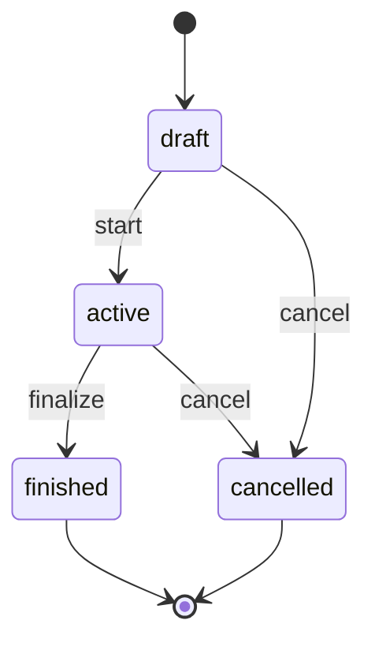

# Спецификация механики аукциона — Telegram Gift Auctions

## Исходный продукт

Данная спецификация основана на анализе механики **Telegram Gift Auctions** — системы аукционов цифровых подарков (Collectible Gifts) в Telegram, введённой в 2024 году.

## Ключевые источники

- Официальная документация Telegram Fragment (анонс Gift Auctions)
- Наблюдения за реальными аукционами в Telegram (публичные данные)
- Telegram Bot API и Fragment платформа
- Обратная разработка на основе поведения UI и временных паттернов

## Термины

- **Аукцион (Auction)** — конкурс за получение ограниченного количества цифровых подарков
- **Лот (Lot)** — единица приза; один аукцион может иметь N лотов (N >= 1)
- **Раунд (Round)** — временной этап аукциона с фиксированной длительностью
- **Участник (Participant)** — пользователь, делающий ставки
- **Ставка (Bid)** — предложение участника о сумме, которую он готов заплатить
- **Eligibility (квалификация)** — право участника продолжать торги в следующем раунде
- **Hold (холд)** — резервирование средств на счёте участника
- **Capture (списание)** — конвертация hold в фактическое списание
- **Release (возврат)** — снятие hold без списания

---

## 1. Жизненный цикл аукциона

### 1.1. Состояния



#### draft (создан)
- Аукцион создан, но не стартовал
- Ставки запрещены
- Можно отменить без финансовых последствий

#### active (активен)
- Аукцион запущен, идёт раунд №1 или последующие
- Участники могут делать ставки (если eligible)
- Автоматические переходы раундов через Worker

#### finished (завершён)
- Определены победители (winners)
- Все финансовые операции закрыты
- Неизменяемое состояние

#### cancelled (отменён)
- Аукцион отменён администратором
- Все hold возвращены участникам
- Неизменяемое состояние

---

## 2. Модель лотов

### 2.1. Концепция

В Telegram Gift Auctions один аукцион может разыгрывать несколько идентичных призов. Количество призов определяется полем `lotsCount`.

**Пример:** Аукцион на 5 редких стикеров → `lotsCount = 5` → топ-5 участников получают по стикеру.

### 2.2. Связь с отсевом

- На каждом раунде проходят топ-K участников (по сумме ставки)
- K определяется параметром `topK` (обычно > lotsCount для создания конкуренции)
- Когда количество квалифицированных участников <= lotsCount → финализация

### 2.3. Финализация

**Условие:** `qualified.length <= lotsCount`

**Алгоритм:**
1. Все квалифицированные участники становятся победителями
2. Их hold конвертируется в capture (списание)
3. Массивы `winners` и `winningBids` заполняются
4. Статус → `finished`

**Финансы:**
- Победители: `capture` их максимальной ставки
- Проигравшие: `release` их hold (если есть)

---

## 3. Раунды

### 3.1. Длительность

Каждый раунд имеет фиксированную базовую длительность `roundDurationSec`.

**Временные метки:**
- `scheduledEndsAt` — планируемое окончание без anti-sniping
- `endsAt` — фактическое окончание с учётом продлений (effective_end_at)

**Формула старта раунда:**
```
scheduledEndsAt = endsAt = now + roundDurationSec
```

### 3.2. Переход раунда

**Триггер:** Worker обнаруживает `currentRoundEndsAt <= now`

**Алгоритм:**
1. Получить топ-K участников по ставкам
2. Release hold для вылетевших участников
3. Если `qualified.length <= lotsCount` → финализация
4. Иначе → переход на раунд N+1:
   - `currentRoundNo += 1`
   - `currentRoundEndsAt = now + roundDurationSec`
   - `currentRoundEligible = qualified`

### 3.3. Отсев участников (Eligibility)

**Правило:** Только топ-K участников по текущей максимальной ставке проходят в следующий раунд.

**Ранжирование:**
1. Сумма максимальной ставки участника (desc)
2. Время первой ставки с этой суммой (asc) — tie-breaker

**Реализация:**
- После закрытия раунда вычисляется список `qualified`
- `currentRoundEligible = qualified`
- В следующем раунде проверка: `if (!currentRoundEligible.includes(participantId)) → 403 Forbidden`

**Первый раунд:** Все участники eligible (поле не задано или пусто).

---

## 4. Ставки

### 4.1. Минимальный шаг (Min Increment)

**Правило:** Каждая новая ставка участника должна превышать его текущую на минимальный шаг.

```
newAmount >= currentAmount + minIncrement
```

**Где:**
- `currentAmount` — максимальная ставка участника в аукционе (по всем раундам)
- `minIncrement` — параметр аукциона (фиксированная сумма)

**Ошибка:** `422 UnprocessableEntity` если правило нарушено.

### 4.2. Текущая ставка участника

**Модель:** Одна активная ставка на участника в аукционе.

В БД хранятся все ставки как события (`Bid` documents), но «активная ставка» вычисляется как:
```
max(amount) WHERE participantId = X AND status = 'placed'
```

При повышении ставки:
- Создаётся новый документ `Bid` с большей суммой
- Старая ставка остаётся (история), но эффективная ставка = max

### 4.3. Ранжирование

**Сортировка участников:**
1. Максимальная ставка (desc)
2. Время фиксации этой ставки (asc)

**Tie-breaking:** Если две ставки равны, побеждает участник, сделавший ставку раньше.

**Реализация:**
```javascript
// Агрегация: получить max amount per participant + earliest createdAt
BidModel.aggregate([
  { $match: { auctionId, status: 'placed' } },
  { $sort: { amount: -1, createdAt: 1 } },
  { $group: {
      _id: '$participantId',
      amount: { $first: '$amount' },
      committedAt: { $first: '$createdAt' }
  }},
  { $sort: { amount: -1, committedAt: 1 } }
])
```

### 4.4. Валидация времени

**Правило:** Ставка отклоняется, если `now >= currentRoundEndsAt`.

**Код:** `409 Conflict: "round is already closed"`

**Гонка:** Возможна ситуация, когда ставка проходит проверку времени, но Worker уже начал закрытие раунда. Защита через условный update в транзакции.

---

## 5. Anti-Sniping

### 5.1. Проблема

**Sniping** — стратегия размещения ставки в последнюю секунду, чтобы конкуренты не успели ответить.

**Решение:** Автоматическое продление раунда при активности в последние N секунд.

### 5.2. Параметры

- `snipingWindowSec` — окно (последние N секунд раунда), в котором триггерится продление
- `extendBySec` — на сколько секунд продлевать
- `maxExtensionsPerRound` — лимит продлений (защита от бесконечного раунда)

**Пример:**
```
snipingWindowSec = 10
extendBySec = 10
maxExtensionsPerRound = 5
```

### 5.3. Правило продления

**Условие (все должны выполняться):**
1. `extendBySec > 0`
2. `snipingWindowSec > 0`
3. `maxExtensionsPerRound > 0`
4. Ставка сделана в окне: `now >= endsAt - snipingWindowSec`
5. Лимит не исчерпан: `extensionsCount < maxExtensionsPerRound`

**Формула нового endsAt:**
```
candidateEndsAt = max(currentEndsAt, now) + extendBySec
```

**Обоснование:** Гарантирует минимум `extendBySec` секунд от момента ставки, даже если сервер обрабатывает запрос с задержкой.

### 5.4. Атомарность

Продление происходит **в той же транзакции**, что и запись ставки.

**Условный update:**
```javascript
AuctionModel.updateOne(
  {
    _id: auctionId,
    status: 'active',
    currentRoundNo: roundNo,
    currentRoundEndsAt: { $lt: candidateEndsAt },
    rounds: { $elemMatch: {
      roundNo,
      status: 'active',
      extensionsCount: { $lt: maxExtensions }
    }},
    $expr: {
      $and: [
        { $lt: [now, '$currentRoundEndsAt'] },
        { $gte: [now, { $subtract: ['$currentRoundEndsAt', windowMs] }] }
      ]
    }
  },
  {
    $set: {
      currentRoundEndsAt: candidateEndsAt,
      'rounds.$[r].endsAt': candidateEndsAt
    },
    $inc: { 'rounds.$[r].extensionsCount': 1 }
  }
)
```

**Если update прошёл:** `effectiveEndsAt = candidateEndsAt`  
**Если не прошёл:** Ставка принята, но продления не было (лимит исчерпан или конкурентная ставка)

### 5.5. Отличия от классического варианта

**Классическая формула (аукционы eBay):**
```
endsAt = max(endsAt, now + extendBySec)
```

**Наша реализация:**
```
endsAt = max(endsAt, now) + extendBySec
```

**Разница:** Мы всегда гарантируем полные `extendBySec` секунд от момента ставки, что честнее при высоких нагрузках.

---

## 6. Финансовые потоки

### 6.1. Hold на ставке

**Правило:** При размещении/повышении ставки холд увеличивается только на **дельту**.

```
delta = newAmount - currentAmount
hold += delta
```

**Обоснование:** Избежать двойного резервирования. Если участник повышает ставку с 100 до 150, холд увеличивается на 50, а не на 150.

**TxId для идемпотентности:**
```
holdTxId = `hold:${auctionId}:${roundNo}:${participantId}:${idempotencyKey ?? newAmount}`
```

### 6.2. Release для вылетевших

**Когда:** При закрытии раунда для участников, не прошедших в топ-K.

**Алгоритм:**
1. Получить список `disqualified = allParticipants \ qualified`
2. Для каждого: `releaseHold(participantId, maxAmount)`

**Эффект:**
- `hold -= amount`
- `balance` без изменений
- Средства возвращаются в доступный баланс

**TxId:**
```
releaseTxId = `close:${auctionId}:${roundNo}:${participantId}:release`
```

### 6.3. Capture для победителей

**Когда:** При финализации аукциона (только для winners).

**Алгоритм:**
1. Определить топ-N участников (N = lotsCount)
2. Для каждого: `captureHold(participantId, maxAmount)`

**Эффект:**
- `hold -= amount`
- `balance -= amount`
- Средства списаны с баланса

**TxId:**
```
captureTxId = `finalize:${auctionId}:${participantId}:capture`
```

### 6.4. Отличия от промежуточной модели

**Альтернативная модель:** Capture на каждом раунде для qualified.

**Почему не используется:**
- Участник может пройти несколько раундов и заплатить несколько раз
- Не соответствует логике Telegram Gift Auctions
- Усложняет отмену аукциона

**Текущая модель:**
- Hold накапливается на протяжении всех раундов
- Capture только при финализации для winners
- Проигравшим release при вылете или финализации

### 6.5. Отмена аукциона (Cancel)

**Сценарий:** Администратор отменяет аукцион до завершения.

**Алгоритм:**
1. Получить всех участников с placed bids
2. Для каждого: `releaseHold(participantId, maxAmount)`
3. `status = 'cancelled'`

**TxId:**
```
cancelTxId = `cancel:${auctionId}:${participantId}:release`
```

**Идемпотентность:** Повторный cancel не делает дубликатов release (проверка `txId` в ledger).

---

## 7. Конкурентность и восстановление

### 7.1. Транзакции MongoDB

**Требование:** Replica set (минимум single-node replica set для локальной разработки).

**Стратегия:** `withTransactionRetries` — автоповтор транзакций при временных ошибках (WriteConflict).

**Критические операции в транзакции:**
1. Размещение ставки: hold + запись bid + продление endsAt
2. Закрытие раунда: release для вылетевших + условный update auction
3. Финализация: capture для winners + release для проигравших + update auction

### 7.2. Идемпотентность ставок

**Механизм:** Уникальный индекс на `(auctionId, roundNo, participantId, idempotencyKey)`.

**Поведение:**
- Первая ставка с ключом → успех
- Повторная ставка с тем же ключом → `11000 DuplicateKey` → подавляется как идемпотентный повтор

**Ledger:** Hold также идемпотентен через уникальный `txId`.

### 7.3. Идемпотентность закрытия раунда

**Проблема:** Несколько Worker инстансов или ручное закрытие + Worker.

**Решение:** Условный update с проверкой `currentRoundNo` и `rounds[].status`.

```javascript
AuctionModel.updateOne(
  {
    _id: auctionId,
    status: 'active',
    currentRoundNo: roundNo,
    rounds: { $elemMatch: { roundNo, status: 'active' } }
  },
  { $set: { ... } }
)
```

**Если `modifiedCount !== 1`:** Транзакция прерывается → rollback ledger операций.

### 7.4. Восстановление после рестарта

**Текущая стратегия:** Active recovery через Worker + Reconcile Worker.

**Алгоритм:**
1. Worker периодически ищет `status=active AND currentRoundEndsAt <= now`
2. Закрывает просроченные раунды
3. Индекс `{ status: 1, currentRoundEndsAt: 1 }` обеспечивает быстрый поиск

**Reconcile Worker (✅ реализован):**
- Проверяет инвариант `total = available + held` для всех аккаунтов
- Обнаруживает зависшие holds после завершения аукционов (orphaned holds)
- Проверяет соответствие holds активным ставкам
- Автоматически исправляет безопасные случаи (release orphaned holds)
- Создаёт записи для ручного разбора сложных случаев

**Compensating Transactions:**
- При ошибках capture/release в финализации создаются записи `ReconcileIssue`
- Reconcile worker пытается исправить их при следующем запуске
- После 3 неудачных попыток issue переходит в статус `manual_review`
- Модель `ReconcileIssue` отслеживает тип проблемы, детали, попытки исправления

**Что НЕ делается:**
- Пересчёт effective_end_at по событиям (доверяем denormalized полям)

---

## 8. Наблюдаемость

### 8.1. Метрики

- `bids_total{status, reason}` — счётчик ставок (ok/rejected с причинами)
- Prometheus endpoint: `GET /metrics`

### 8.2. Логирование

**Формат:** JSON (structured logs)

**Критические события:**
- `[auction] finalize: currentRoundEligible is empty` — диагностика пустого раунда
- Worker errors (подавляются в catch, но требуют attention)

### 8.3. Диагностика конфликтов

**Ошибка:** `close race` в catch block

**Значение:** Конкурентное закрытие раунда. Транзакция откатилась (это норма).

**Действие:** Повторный Worker tick обработает аукцион повторно, если раунд всё ещё просрочен.

---

## 9. Архитектурные решения

### 9.1. Embedded rounds vs отдельная коллекция

**Решение:** Embedded `rounds` массив в `Auction` документе.

**Обоснование:**
- Атомарные обновления раунда и аукциона
- Нет необходимости в join'ах
- История раундов компактна (обычно < 10 раундов)

**Trade-off:** Ограничение на 16MB документа Mongo (не проблема для аукционов).

### 9.2. Denormalization: currentRoundNo/currentRoundEndsAt

**Решение:** Дублирование на корне документа.

**Обоснование:**
- Быстрые запросы Worker'а: `{ status: 'active', currentRoundEndsAt: { $lte: now } }`
- Избежать $elemMatch в критических запросах

**Консистентность:** Обновляется атомарно в той же операции, что и embedded round.

### 9.3. Ledger: single-entry vs double-entry

**Решение:** Simplified single-entry (debit=credit account).

**Обоснование:**
- Для демо-проекта достаточно одного account на участника
- Нет внешних платёжных систем
- Упрощённая reconcile логика

**Trade-off:** Сложнее масштабировать на multi-currency или escrow сценарии.

### 9.4. Worker polling vs event-driven

**Решение:** Worker с интервалом `WORKER_INTERVAL_MS` (default 1000ms).

**Обоснование:**
- Простота реализации
- Индекс обеспечивает эффективность выборки
- Для конкурса достаточно

**Trade-off:** Задержка до 1 секунды на закрытие раунда (приемлемо для roundDurationSec >= 30).

**Альтернатива:** TTL index Mongo + Change Streams (сложнее, но реалтаймнее).

---

## 10. Ограничения и компромиссы

### 10.1. Точность денежных расчётов

**Решение:** Decimal128 в Mongo + строковые операции через `money` helpers.

**Компромисс:** В конфигурации anti-sniping используется `Number()` (но это не деньги, а секунды).

**Критично:** Избегать `Number()` для сумм ставок/балансов.

### 10.2. Отсутствие Outbox pattern

**Статус:** Модель `OutboxEvent` присутствует, но не используется.

**Последствия:**
- Нет гарантированной доставки событий во внешние системы
- Невозможность воспроизвести историю по событиям

**Рекомендация:** Для продакшена добавить Outbox publisher.

### 10.3. Отсутствие модели Lot

**Статус:** Лоты представлены числом `lotsCount`, но нет отдельной коллекции `Lot` с индивидуальными свойствами.

**Последствия:**
- Невозможно разыгрывать разные призы в одном аукционе
- Winners и winningBids — просто массивы

**Обоснование:** Telegram Gift Auctions разыгрывают идентичные подарки.

### 10.4. Транзакции на standalone MongoDB

**Проблема:** Standalone Mongo (без replica set) не поддерживает транзакции.

**Решение:** Docker compose настроен на single-node replica set `rs0`.

**Продакшен:** Требуется полноценный replica set (минимум 3 ноды).

---

## 11. Соответствие Telegram Gift Auctions

### 11.1. Наблюдаемое поведение

На основе анализа публичных аукционов в Telegram Fragment:

1. **Многораундовая система:** ✅ Реализована
2. **Отсев по топ-N:** ✅ Реализован через `topK`
3. **Anti-sniping:** ✅ Реализован с продлением раунда
4. **Hold → Capture для победителей:** ✅ Реализовано
5. **Tie-breaking по времени:** ✅ Реализовано (earliest wins)

### 11.2. Различия и адаптации

| Аспект | Telegram | Наша реализация | Обоснование |
|--------|----------|-----------------|-------------|
| Валюта | TON (Toncoin) | Любая (RUB default) | Демо-проект |
| Платёжная система | Telegram Wallet | Виртуальные балансы | Упрощение |
| UI | Telegram Mini App | Web UI (standalone) | Независимость |
| Продление формула | Неизвестна точно | `max(endsAt, now) + extend` | Консервативный подход |
| Reconcile | Предполагается | Отсутствует | MVP scope |

### 11.3. Доверенные допущения

- **Финализация:** Capture происходит только при завершении аукциона (не по раундам)
- **Release:** Вылетевшие получают release немедленно (не ждут финализации)
- **MaxExtensions:** Лимит продлений необходим (иначе раунд может длиться бесконечно)

---

## 12. Тестирование механики

### 12.1. Unit tests

Покрыто в `test/auctions.test.ts`:
- Создание и старт аукциона
- Размещение ставок и min increment
- Eligibility (отсев участников)
- Финализация при `qualified <= lotsCount`
- Отмена аукциона и release holds

### 12.2. Load tests (k6)

`load/k6.js`:
- Конкурентные ставки от 100 участников
- Проверка инвариантов балансов (`available >= 0`)
- Anti-sniping режим с высокой интенсивностью в окне

### 12.3. Ручное тестирование

UI сценарий:
1. Создать аукцион с `lotsCount=2`, `topK=3`, `roundDurationSec=30`
2. Запустить 5 участников (ботов)
3. Наблюдать отсев после раунда 1 (остаётся 3)
4. После раунда 2 финализация (остаётся 2)
5. Проверить `winners` и release для проигравших

---

## 13. Рекомендации для продакшена

### 13.1. Уже реализовано

1. ✅ **Reconcile job:** Периодическая проверка consistency между hold и active bids
   - Проверка инвариантов балансов
   - Обнаружение orphaned holds
   - Автоматическое исправление с compensating transactions
   - Модель ReconcileIssue для отслеживания проблем

2. ✅ **Optimistic locking:** Retry механизм для конкурентных операций
   - `withTransactionRetries` для MongoDB транзакций
   - Условные обновления с проверкой статуса

3. ✅ **Metrics:** Prometheus метрики для мониторинга
   - `bids_total{status, reason}` — ставки по статусам
   - Встроенный endpoint `/metrics`

4. ✅ **55 тестов:** Покрытие критических сценариев
   - Финансовые операции
   - Конкурентность
   - Eligibility и отсев
   - Anti-sniping

### 13.2. Требуется для production

1. **Replica set:** Минимум 3 ноды MongoDB (обязательно)
2. **Мониторинг:** Alerting на долгие раунды, большие дельты времени
3. **Outbox events:** Публикация доменных событий для интеграций (если требуется)

### 13.3. Опциональные расширения

1. **Lot модель:** Индивидуальные призы (редкость, метаданные)
2. **Cancel policy:** Возможность частичной отмены (только новые ставки)
3. **Bid history API:** Публичная лента ставок для transparency
4. **WebSocket:** Реалтайм обновления лидерборда

---

## Заключение

Данная спецификация описывает production-ready реализацию многораундовой аукционной системы, основанной на механике Telegram Gift Auctions. Ключевые отличия от классических аукционов:

- **Многораундовость** с отсевом участников
- **Anti-sniping** через автоматическое продление
- **Hold-based финансы** с отложенным capture
- **Tie-breaking** по времени для честности

Реализация обеспечивает атомарность через MongoDB транзакции, идемпотентность через уникальные ключи, и наблюдаемость через метрики/логи.
